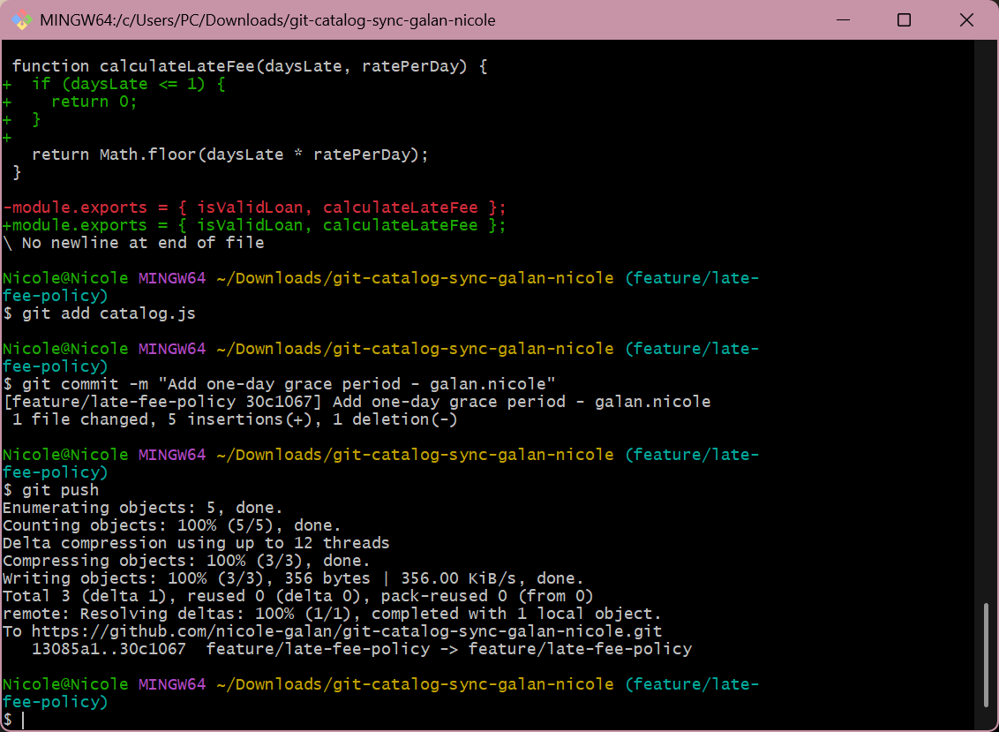
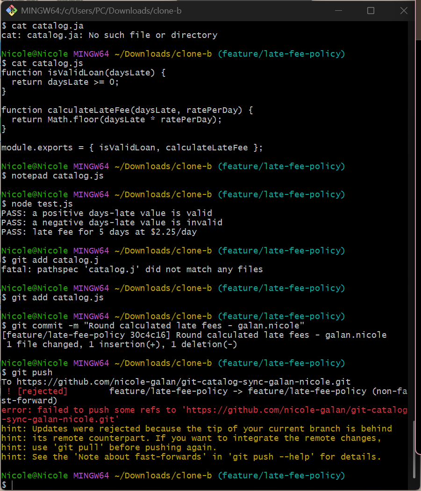
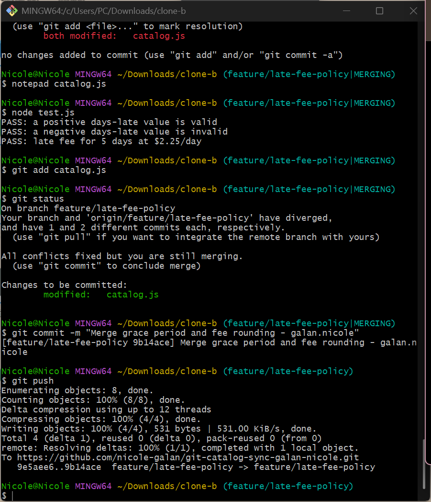
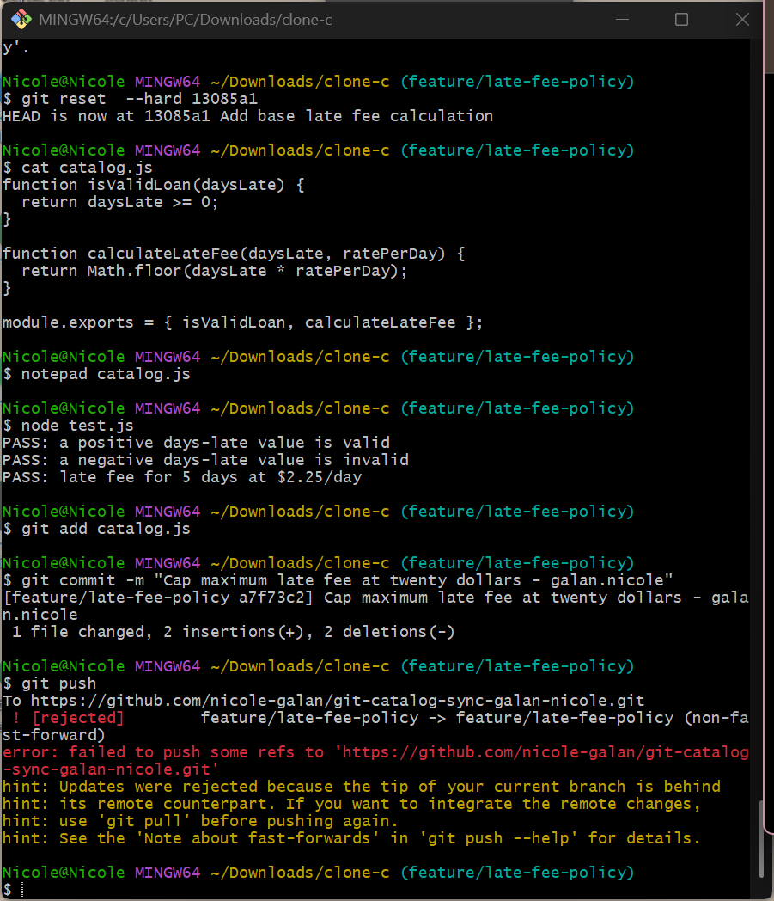
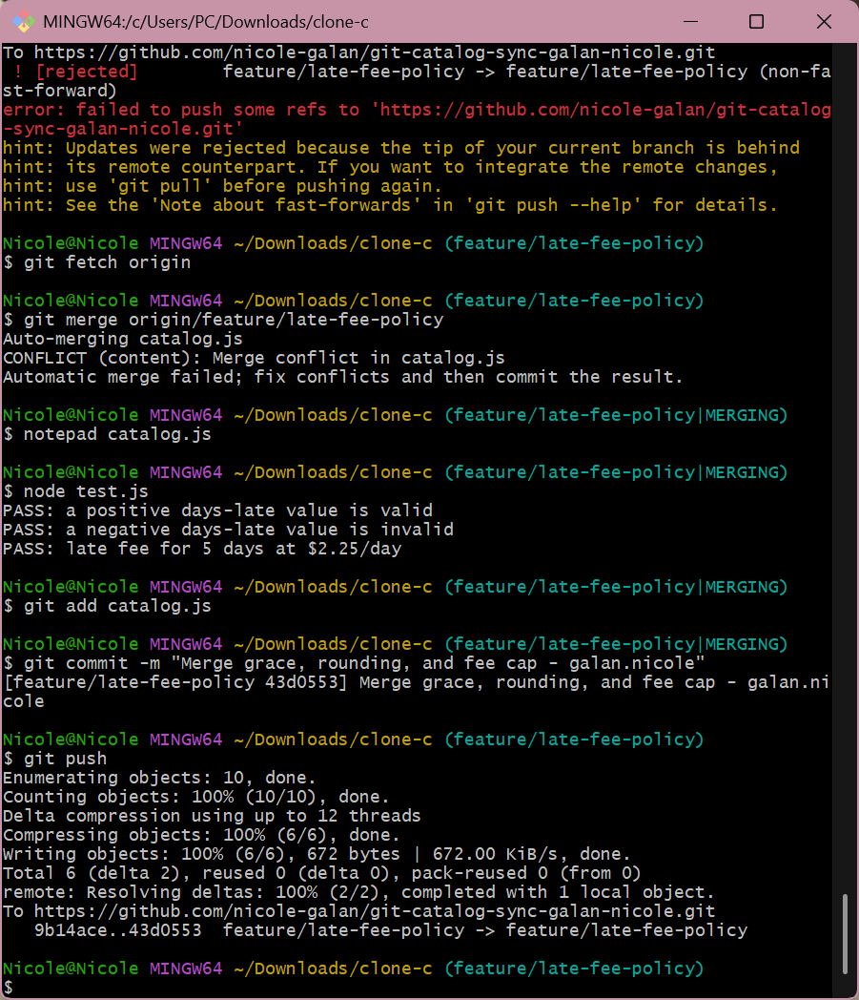
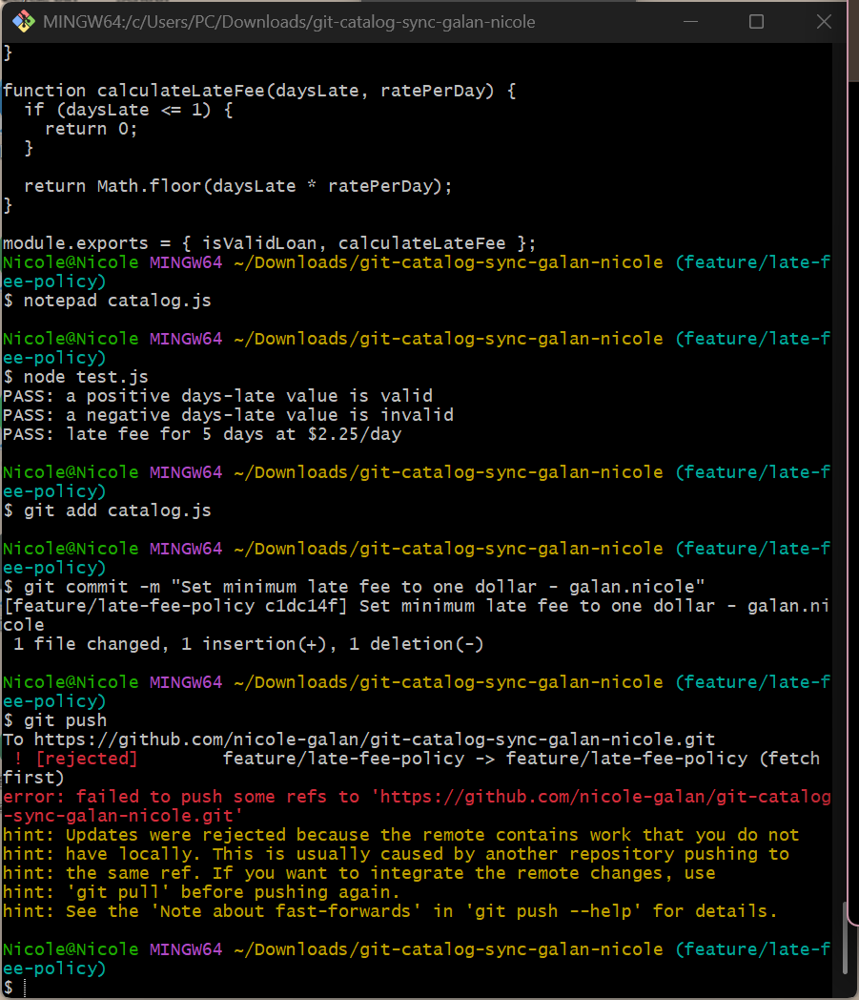
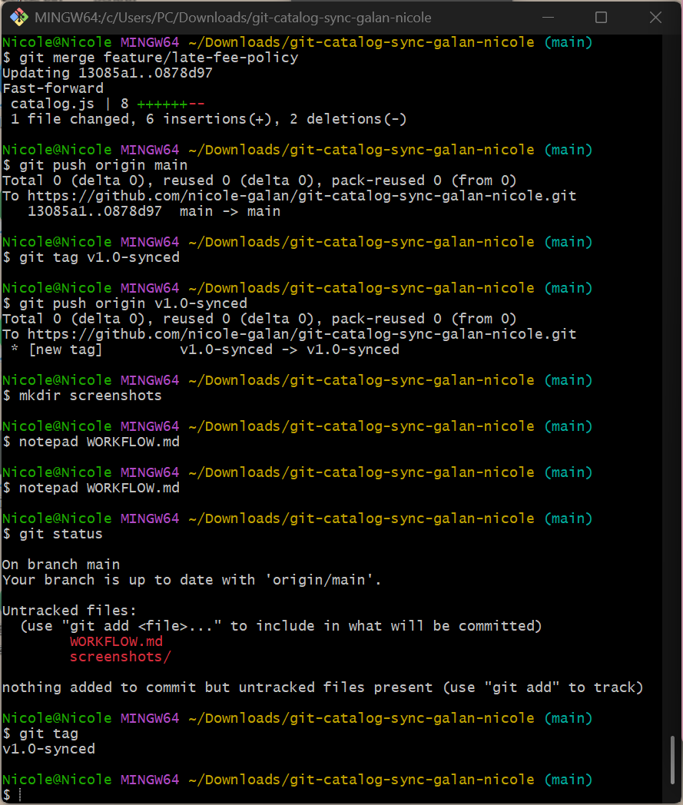

# Git Catalog Sync Workflow

## 1. Final calculateLateFee

The final `calculateLateFee` function combines four behaviors contributed during the synchronization workflow.

* The one-day grace period returns a fee of 0 when `daysLate <= 1`.
* Fee rounding uses `Math.round()`.
* The maximum late fee is capped at $20 using `Math.min()`.
* The minimum late fee is $1 using `Math.max()`.

The final calculation is:

```javascript
function calculateLateFee(daysLate, ratePerDay) {
  if (daysLate <= 1) {
    return 0;
  }

  return Math.max(Math.min(Math.round(daysLate * ratePerDay), 20), 1);
}
```

The grace-period behavior was introduced in Task 1, rounding was introduced in Task 2, the $20 maximum was introduced in Task 4, and the $1 minimum was introduced in Task 6.

## 2. Task 3 vs. Task 5 conflicts

Task 3 involved a two-way conflict between the grace-period change and the rounding change. The conflict occurred because two contributors modified the same part of `catalog.js` independently.

Task 5 involved a three-way conflict because Clone C had its own $20 maximum-fee change while the remote branch already contained the grace-period and rounding changes. The final resolution had to preserve all three behaviors.

## 3. Merge vs. Rebase

A merge combines two lines of development and creates a merge commit when the branches have diverged. This preserves the separate branch histories.

A rebase takes the local commits and reapplies them on top of the updated remote branch. This creates a more linear history but rewrites the local commit history.

In this workflow, Clone B and Clone C used merge to synchronize their changes, while Clone A used rebase for the final synchronization.

## 4. Process improvement

The rejected pushes could have been prevented by synchronizing with the shared remote branch before making changes to the same branch.

A better process would be to fetch and review the latest remote changes before starting work, communicate which contributor is modifying the shared branch, and integrate existing changes before committing new work.

This would reduce conflicting changes and avoid rejected pushes caused by outdated local branches.

## Screenshots

### Task 1



### Task 2



### Task 3



### Task 4



### Task 5



### Task 6



### Task 7


